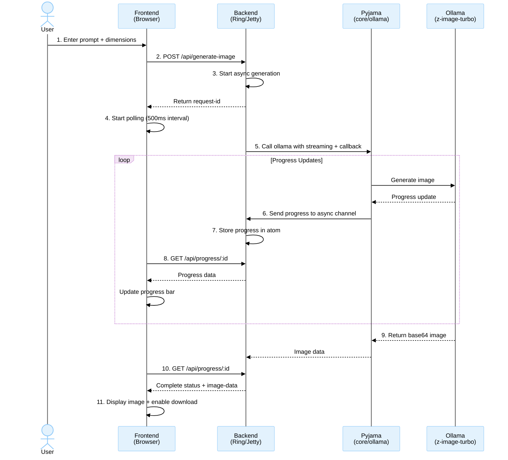

# 🎨 AI Image Generator Agent - Pyjama Showcase

A complete full-stack Pyjama agent showcase demonstrating AI image generation from text prompts using Ollama's experimental image generation with Alibaba's Z-Image Turbo model. Features real-time progress tracking, a beautiful modern UI, and seamless integration with the Pyjama agent framework.

**Example Generated Image:**


*Generated with prompt: "A summer beach à la Matisse" (512×512)*

## ✨ Features

- **🎨 Text-to-Image Generation**: Transform natural language descriptions into images
- **📊 Real-Time Progress**: HTTP polling-based progress tracking with visual progress bar
- **🎛️ Customizable Dimensions**: Choose from presets (128×128, 512×512, 1024×768, 1024×1024) or custom sizes
- **👀 Live Preview**: See generated images instantly in the browser
- **💾 Download**: Save generated images as PNG files
- **🌈 Modern UI**: Beautiful gradient design with smooth animations
- **⚡ Fast Development**: One-command startup with automatic dependency installation

## 🚀 Quick Start

### Prerequisites

1. **Ollama** must be installed and running:
   ```bash
   ollama serve
   ```

2. **Z-Image Turbo model** must be available:
   ```bash
   ollama pull x/z-image-turbo
   ```

3. **Node.js** and **npm** for ClojureScript compilation
4. **Clojure CLI tools** for running the backend

### Running the Application

**Option 1: Using the start script (recommended)**

```bash
./start.sh
```

This will:
- Check if Ollama is running
- Install the image model if needed
- Start the backend server (port 3000)
- Start the frontend dev server (port 8020)
- Open your browser automatically

**Option 2: Manual start**

Terminal 1 - Backend:
```bash
clj -M:run
```

Terminal 2 - Frontend:
```bash
npm install
npm run watch
```

Browser:
```
http://localhost:8020
```

## 📖 Usage Guide

1. **Enter a Prompt**: Describe the image you want to generate
   - Example: "A serene sunset over mountains in the style of Monet"
   - Example: "A futuristic city with flying cars, cyberpunk style"
   - Example: "A summer beach à la Matisse"

2. **Choose Dimensions**: Select a preset or enter custom width/height
   - **128×128** - Tiny test images (~30 seconds)
   - **512×512** - Fast generation (~2-3 minutes)
   - **1024×768** - Standard quality (~5-7 minutes)
   - **1024×1024** - High quality (~7-10 minutes)

3. **Generate**: Click the "✨ Generate Image" button

4. **Watch Progress**: See real-time progress as the image generates
   - Progress bar shows completion percentage
   - Step counter (e.g., "Step 6 of 9")
   - Progress updates every 500ms via HTTP polling

5. **Download**: Once complete, download the generated image as PNG

## 🏗️ Architecture

### Full-Stack Architecture

```mermaid
%%{init: {'theme':'base', 'themeVariables': {'primaryColor':'#E3F2FD','primaryTextColor':'#000000','primaryBorderColor':'#90CAF9','secondaryColor':'#FCE4EC','secondaryTextColor':'#000000','secondaryBorderColor':'#F48FB1','tertiaryColor':'#F3E5F5','tertiaryTextColor':'#000000','tertiaryBorderColor':'#CE93D8','lineColor':'#666','textColor':'#000000','fontSize':'14px'}}}%%
flowchart LR
    Frontend["<b>Frontend</b><br/>ClojureScript/Reagent<br/>• Prompt input<br/>• Progress polling<br/>• Image preview"]
    Backend["<b>Backend</b><br/>Ring/Jetty Server<br/>• /api/generate-image<br/>• /api/progress/:id<br/>• Async generation"]
    Pyjama["<b>Pyjama</b><br/>pyjama.core/ollama<br/>• Streaming mode<br/>• Progress callback<br/>• Returns base64"]
    Ollama["<b>Ollama</b><br/>z-image-turbo<br/>• Receives prompt<br/>• Generates image<br/>• Returns PNG"]
    
    Frontend -->|"HTTP POST/GET"| Backend
    Backend --> Pyjama
    Pyjama -->|"HTTP API"| Ollama
    
    classDef frontendStyle fill:#E3F2FD,stroke:#90CAF9,stroke-width:2px,color:#000000
    classDef backendStyle fill:#FCE4EC,stroke:#F48FB1,stroke-width:2px,color:#000000
    classDef pyjamaStyle fill:#F3E5F5,stroke:#CE93D8,stroke-width:2px,color:#000000
    classDef ollamaStyle fill:#FFF9C4,stroke:#FFF59D,stroke-width:2px,color:#000000
    
    class Frontend frontendStyle
    class Backend backendStyle
    class Pyjama pyjamaStyle
    class Ollama ollamaStyle
```



### Request Flow



### Key Technical Implementation

**Backend (Clojure)**
- **Ring HTTP server** with CORS support
- **Async image generation** using futures
- **Progress tracking** via atoms and request IDs
- **Combined callback pattern**: Sends progress to channel AND returns final image
- **HTTP polling API** instead of WebSocket (simpler, more reliable)

**Frontend (ClojureScript)**
- **Reagent** for reactive UI components
- **cljs-ajax** for HTTP requests
- **Polling mechanism** with setInterval for progress updates
- **Base64 image rendering** directly in browser
- **State management** with single Reagent atom

## 📡 API Reference

### POST /api/generate-image

Starts image generation and returns a request ID.

**Request:**
```json
{
  "prompt": "A summer beach à la Matisse",
  "width": 512,
  "height": 512
}
```

**Response:**
```json
{
  "success": true,
  "request-id": "96d3bb90-991a-4476-90a2-b5fc6b0e8935",
  "message": "Image generation started"
}
```

### GET /api/progress/:request-id

Checks the current status and progress of an image generation request.

**Response (generating):**
```json
{
  "status": "generating",
  "progress": {
    "completed": 5,
    "total": 9
  }
}
```

**Response (complete):**
```json
{
  "status": "complete",
  "image-data": "iVBORw0KGgoAAAANSUhEUgAA...",
  "width": 512,
  "height": 512,
  "prompt": "A summer beach à la Matisse"
}
```

**Response (error):**
```json
{
  "status": "error",
  "error": "No image data returned"
}
```

## 🛠️ Technology Stack

### Backend
- **Clojure 1.12.1** - Server-side logic
- **Ring 1.13.0** - HTTP server framework
- **Jetty 11** - Embedded web server
- **ring-json** - JSON middleware
- **ring-cors** - CORS support
- **Pyjama** - Agent framework and Ollama integration
- **core.async** - Asynchronous channel-based concurrency

### Frontend
- **ClojureScript** - Frontend logic compilation
- **Reagent** - React wrapper for ClojureScript
- **shadow-cljs** - Modern ClojureScript build tool
- **cljs-ajax** - Ajax library for ClojureScript
- **React 18.2.0** - UI rendering

### Infrastructure
- **Ollama** - Local LLM/image model runtime
- **Z-Image Turbo** - Alibaba's fast image generation model

## 🎨 Customization

### Change Default Model

Edit `src/image_generator/server.clj`:
```clojure
(pyjama.core/ollama
  ollama-url
  :generate-image
  {:model "your-model-name"  ; Change this
   :prompt prompt
   :width width
   :height height
   :stream true}
  combined-callback)
```

### Adjust Default Dimensions

Edit `src/image_generator/core.cljs`:
```clojure
(def state (r/atom {:width 1024    ; Default width
                    :height 768     ; Default height
                    ...}))
```

### Add More Presets

Edit `src/image_generator/core.cljs`:
```clojure
[:button.preset-btn
 {:on-click #(swap! state assoc :width 2048 :height 2048)
  :disabled (:loading? @state)}
 "2048×2048"]
```

### Modify Polling Interval

Edit `src/image_generator/core.cljs` (line 69):
```clojure
(let [interval (js/setInterval #(poll-progress! request-id) 1000)])  ; 1 second instead of 500ms
```

### Customize Styles

Edit `public/style.css` to change:
- Gradient colors
- Fonts and typography
- Button styles
- Animation timings
- Layout and spacing

## 🐛 Troubleshooting

### "Ollama is not running"
- Start Ollama: `ollama serve`
- Verify it's running: `curl http://localhost:11434/api/version`
- Check logs: Look for errors in the Ollama terminal

### "Model not found: x/z-image-turbo"
- Install the model: `ollama pull x/z-image-turbo`
- List installed models: `ollama list`
- Verify model name matches exactly

### "CORS request did not succeed"
- Ensure backend is running on port 3000
- Check `clj -M:run` terminal for syntax errors
- Restart backend if you made code changes

### "Image generation failed - no image data"
- Check if Ollama has enough VRAM (requires 12-16GB for Z-Image Turbo)
- Try smaller dimensions (128×128 or 256×256) first
- Check Ollama logs for errors
- Verify model works directly: `ollama run x/z-image-turbo "test image"`

### "Progress bar stuck at 100%"
- This is a known edge case where the final image might still be processing
- Wait an additional 30 seconds
- Check browser console (F12) for errors
- Check backend logs for completion message

### Frontend doesn't load
- Ensure `npm install` was run
- Check shadow-cljs is compiling: Look for "Build completed" message
- Clear browser cache and reload (Ctrl+Shift+R / Cmd+Shift+R)
- Check port 8020 isn't used by another process

### Development Tips
- **Backend logs**: Check terminal running `clj -M:run`
- **Frontend logs**: Open browser console (F12)
- **Network inspection**: Browser DevTools → Network tab
- **Reload frontend**: Changes auto-reload with shadow-cljs watch
- **Reload backend**: Restart `clj -M:run` after code changes

## ⚡ Performance Notes

Image generation time depends on:
- **Dimensions**: Larger images take exponentially longer
  - 128×128: ~30 seconds
  - 512×512: ~2-3 minutes
  - 1024×768: ~5-7 minutes
  - 1024×1024: ~7-10 minutes
  - 2048×2048: 15+ minutes
- **Hardware**: GPU VRAM (minimum 12GB for Z-Image Turbo, 16GB recommended)
- **System load**: Other applications compete for GPU resources
- **Model**: Some models are faster but lower quality

### Recommendations

**For Testing:**
- Start with 128×128 to verify everything works (~30sec)
- Use 512×512 for quick iterations (~2min)

**For Production:**
- Use 1024×768 for balanced quality/speed (~5min)
- Reserve 1024×1024+ for final high-quality outputs (~10min)

**Optimization Tips:**
- Close other GPU-heavy applications
- Use smaller dimensions during development
- Consider running Ollama with GPU offloading for faster generation
- Monitor VRAM usage with `nvidia-smi` (NVIDIA) or Activity Monitor (Mac)

## 🧪 Testing

### Manual Testing Flow

1. Start the application: `./start.sh`
2. Enter a simple prompt: "red circle"
3. Select 128×128 dimensions
4. Click "Generate Image"
5. Verify progress bar updates
6. Verify image appears after ~30 seconds
7. Click "Download" and verify PNG saves
8. Click "Generate Another" and verify state resets

### Automated Tests

The Pyjama library includes image generation tests:

```bash
cd /Users/nico/cool/origami-nightweave/pyjama
clj -M:test -n pyjama.image-generation-test
```

Tests cover:
- 64×64 generation
- 128×128 generation  
- 256×256 generation
- Progress callback functionality
- Error handling

## 📚 Project Structure

```
image-generator-agent/
├── src/
│   └── image_generator/
│       ├── server.clj          # Ring backend with polling API
│       └── core.cljs           #Reagent frontend
├── public/
│   ├── index.html              # HTML entry point
│   └── style.css               # Styling with gradients
├── resources/
│   └── logback.xml             # Logging configuration (suppresses Jetty DEBUG)
├── deps.edn                    # Clojure dependencies
├── shadow-cljs.edn             # ClojureScript build config
├── package.json                # NPM dependencies
├── image-generator-agent.edn   # Agent configuration
├── start.sh                    # One-command startup script
├── AI Image Generator - Pyjama Showcase.png  # Screenshot
└── README.md                   # This file
```

## 🔗 Related Projects

- **[movie-review-agent](../movie-review-agent)** - Movie analysis showcase with similar architecture
- **[Pyjama Documentation](../../pyjama/README.md)** - Core framework documentation
- **[Ollama](https://ollama.com)** - Local LLM runtime
- **[Z-Image Models](https://huggingface.co/collections/Zdream/z-image-67630a39aa10c31e14e03c50)** - Alibaba's image generation models

## 🎯 Key Learnings & Implementation Notes

### Why HTTP Polling Instead of WebSockets?

Initially implemented with WebSockets, but switched to HTTP polling for several reasons:
1. **Simpler implementation** - No WebSocket adapter version conflicts
2. **More reliable** - HTTP is stateless and doesn't require persistent connections
3. **Easier debugging** - Network tab shows all requests clearly
4. **Better compatibility** - Works through more proxies and firewalls

### Async Channel Handling

The implementation uses a **combined callback pattern**:
```clojure
(defn combined-callback [progress-ch request-id]
  (fn [parsed]
    ;; Send progress to channel
    (when (or (:completed parsed) (:total parsed))
      (async/go (async/>! progress-ch parsed)))
    ;; Return final image (for stream function to accumulate)
    (when (:done parsed)
      (:image parsed))))
```

This allows **dual output**:
- Progress updates → async channel → stored in atom → polled by frontend
- Final image data → returned by stream function → sent to client

### Pyjama Stream Function Enhancement

Modified `pyjama.core/stream` to accumulate and return the final callback result:
```clojure
(reduce (fn [acc line]
          (let [parsed (json/parse-string line true)
                result (_fn parsed)]
            (or result acc)))  ; Keep last non-nil result
        nil
        (line-seq stream))
```

This ensures the final image data is returned from the streaming call.

## 📄 License

Part of the Pyjama agent showcases collection.

## 🙏 Acknowledgments

- **Pyjama Framework** - Agent orchestration and Ollama integration
- **Ollama Team** - Local LLM/image model runtime
- **Alibaba DAMO Academy** - Z-Image Turbo model
- **Clojure & ClojureScript Community** - Amazing ecosystem and tools

---

**Ready to generate some AI art? Run `./start.sh` and let your imagination flow!** 🎨✨
