# 🎬 Movie Review Agent

AI-powered movie review agent using TMDB API and LLMs. Get intelligent movie analysis with plot summaries, critic reviews, and personalized recommendations.

## 🚀 Quick Start

### Option 1: CLI (Recommended)

```bash
./review.sh "Inception"
```

### Option 2: Web UI

```bash
./start.sh
# Visit http://localhost:8020
```

## ✨ What You Get

Each review includes:

- 📊 **Movie Information** - Title, year, rating, genres, runtime
- 📝 **Plot Summary** - Official TMDB description
- 💬 **User Reviews** - Top reviews from real viewers
- 🤖 **AI Analysis** - LLM-powered insights:
  - Quick summary of strengths and quality
  - 3-5 good points (story, acting, direction, etc.)
  - 2-4 areas for improvement
  - Who should watch it
  - 3-4 similar movies you might like

## 📋 Prerequisites

### 1. TMDB API Key (Required)

Get a free API key from [The Movie Database](https://www.themoviedb.org/settings/api)

**Add to one of:**
- `$HOME/secrets.edn`
- `../pyjama/secrets.edn`
- `./secrets.edn`

```clojure
{:tmdb-api-key "your_api_key_here"}
```

**Or set environment variable:**
```bash
export TMDB_API_KEY="your_api_key_here"
```

### 2. LLM Provider (Required)

Configure in pyjama's `secrets.edn`:

```clojure
{:tmdb-api-key "..."
 :open-ai-key "..."          ; for OpenAI
 ; OR
 :anthropic-api-key "..."    ; for Claude
 ; OR
 :deepseek-api-key "..."     ; for DeepSeek
 ; etc.
}
```

## 📖 Usage

### CLI Mode

```bash
# Quick review
./review.sh "The Matrix"

# Science fiction
./review.sh "Interstellar"

# Classics
./review.sh "The Godfather"
```

### Web UI Mode

```bash
# Start the web app
./start.sh

# Open browser to http://localhost:8020
# Type movie name and click "Analyze Movie"
```

### Using Pyjama Directly

```bash
# From this directory
clj -J-Dagents.edn="$(pwd)/movie-review-agent.edn" \
    -M:pyjama run movie-review-agent '{"movie-name":"Inception"}'
```

## 🏗️ How It Works

```mermaid
graph TD
    A[👤 User Input<br/>Movie Name] --> B[🔍 Search TMDB API]
    B --> C[📊 Fetch Movie Details<br/>+ Reviews]
    C --> D[🤖 LLM Analysis]
    D --> E[✨ Beautiful Formatted<br/>Review]
    
    style A fill:#e1f5ff
    style B fill:#fff9e1
    style C fill:#ffe1f5
    style D fill:#e1ffe1
    style E fill:#f5e1ff
```



### Agent Flow

The agent executes 3 simple steps:

1. **`:search-movie`** - Calls TMDB API to find the movie
2. **`:check-results`** - Routes to error or analysis based on search results
3. **`:llm-analyze`** - LLM generates comprehensive review (terminal step)

## 🛠️ Tech Stack

**Backend:**
- Clojure
- [Pyjama](https://github.com/hellonico/pyjama) - Agent framework
- Ring + Jetty - Web server
- TMDB API - Movie data

**Frontend:**
- ClojureScript + Reagent
- cljs-ajax - HTTP client
- Modern CSS with dark mode

**Tools:**
- `movie-review.tools.tmdb` - TMDB API integration
- Uses pyjama's `secrets.core` for API key management

## 📂 Project Structure

```
movie-review-agent/
├── movie-review-agent.edn          # Agent configuration
├── deps.edn                         # Clojure dependencies
├── start.sh                         # Web app launcher
├── review.sh                        # CLI wrapper
├── src/
│   └── movie_review/
│       ├── server.clj              # Ring API server
│       ├── core.cljs               # Reagent frontend
│       └── tools/
│           └── tmdb.clj            # TMDB API integration
├── resources/
│   └── prompts/
│       └── movie_review_analysis.md # LLM prompt template
└── public/
    ├── index.html
    └── css/
        └── styles.css              # UI styling
```

## 🎯 Example Output

```
**Summary**
Inception is a mind-bending masterpiece that redefined the heist 
genre with its layered narrative and stunning visual effects...

**Good Points**
• Innovative concept of dream invasion and shared dreaming
• Outstanding cinematography and visual effects
• Hans Zimmer's epic, unforgettable musical score
• Complex but coherent narrative structure
• Top-tier ensemble cast performances

**Bad Points**
• Dense plot may require multiple viewings
• Slower pacing in the middle section
• Emotional core sometimes overshadowed by spectacle

**Recommendation**
Perfect for fans of intelligent sci-fi and Christopher Nolan's 
filmography. Best experienced on the biggest screen possible.

**If You Liked This, Watch:**
• **The Prestige** - Another Nolan mind-bender with twists
• **Shutter Island** - Psychological thriller exploring reality
• **The Matrix** - Genre-defining sci-fi with reality themes
```

## 🔧 Development

### Running Locally

```bash
# Backend server only (port 3000)
clj -M:server

# Frontend only (port 8020)
npx shadow-cljs watch app

# Both (recommended)
./start.sh
```

### Customizing

- **Agent config**: Edit `movie-review-agent.edn`
- **LLM prompt**: Edit `resources/prompts/movie_review_analysis.md`
- **TMDB tool**: Modify `src/movie_review/tools/tmdb.clj`
- **UI styles**: Update `public/css/styles.css`

## 🐛 Troubleshooting

**"TMDB API key not found"**
- Ensure key is in `secrets.edn` as `:tmdb-api-key`
- Or set `TMDB_API_KEY` environment variable

**"Movie not found"**
- Check movie name spelling
- Try alternative titles (e.g., "The Matrix" vs "Matrix")
- Check TMDB website to verify movie exists

**LLM errors**
- Ensure LLM provider key is configured in pyjama's secrets.edn
- Check your API credit balance

**Port already in use**
- Stop existing server: `pkill -f "clojure.*movie-review"`
- Or change ports in `server.clj` and `shadow-cljs.edn`

## 📝 License

This is an example agent for the Pyjama framework.

## 🙏 Acknowledgments

- [TMDB](https://www.themoviedb.org/) for movie data API
- [Pyjama](https://github.com/hellonico/pyjama) agent framework
- Various LLM providers (OpenAI, Anthropic, DeepSeek, etc.)

---

**Happy movie reviewing!** 🍿✨
